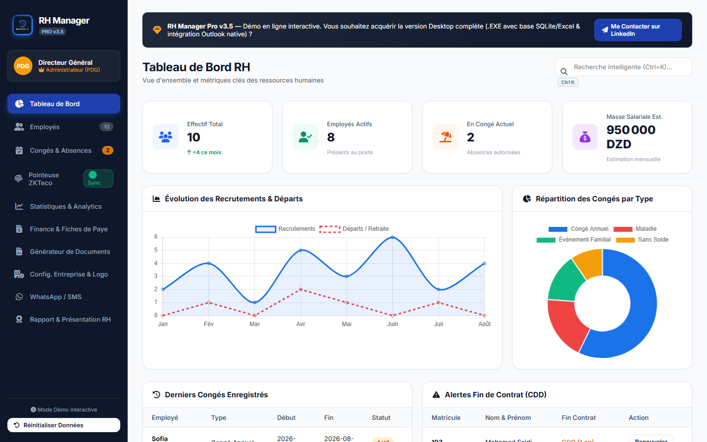

# RH Manager Pro — interactive HR workflow demo

> A browser-based demonstration of a human-resources workflow for Algerian teams: employee records, leave, payroll estimates, and operational reporting in one place.

[](https://mahboubi-younes.github.io/rh-manager-demo/)
[](https://developer.mozilla.org/docs/Web/JavaScript)
[](https://developer.mozilla.org/docs/Web/HTML)
[](https://developer.mozilla.org/docs/Web/CSS)



## The problem it solves

Administrative teams often manage employee data, leave requests, contract deadlines, and payroll preparation across disconnected spreadsheets. This demo shows how a single workflow-oriented system can centralize those day-to-day tasks.

## Who it is for

Small and mid-sized Algerian businesses that want a clear starting point for a tailored HR management application.

## Key features

- Employee directory with statuses and filtering
- Leave and absence tracking with overlap detection
- Dashboard KPIs, recruitment charts, and contract alerts
- Payroll estimator using CNAS and IRG assumptions for demonstration
- Payslip preview and operational reporting
- WhatsApp/SMS and Outlook workflow simulations

## Live demo

Try it here: **[RH Manager Pro demo](https://mahboubi-younes.github.io/rh-manager-demo/)**.

The demo runs entirely in the browser and stores sample data in `localStorage`; it does not require an account or a backend database.

## Run locally

```bash
git clone https://github.com/mahboubi-younes/rh-manager-demo.git
cd rh-manager-demo
```

Open `index.html` in a modern browser, or serve the directory with any static-file server.

## License

This is proprietary demonstration software. See [LICENSE.md](LICENSE.md) for permitted use and commercial licensing terms.
